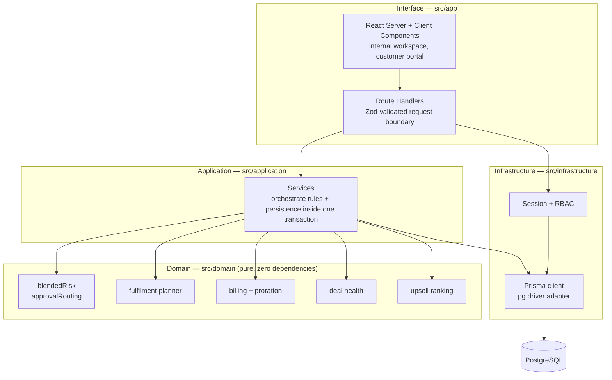
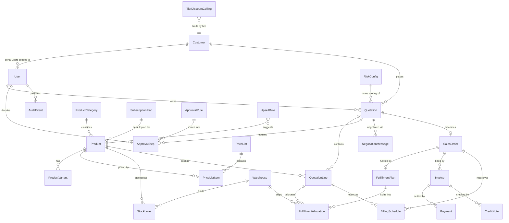
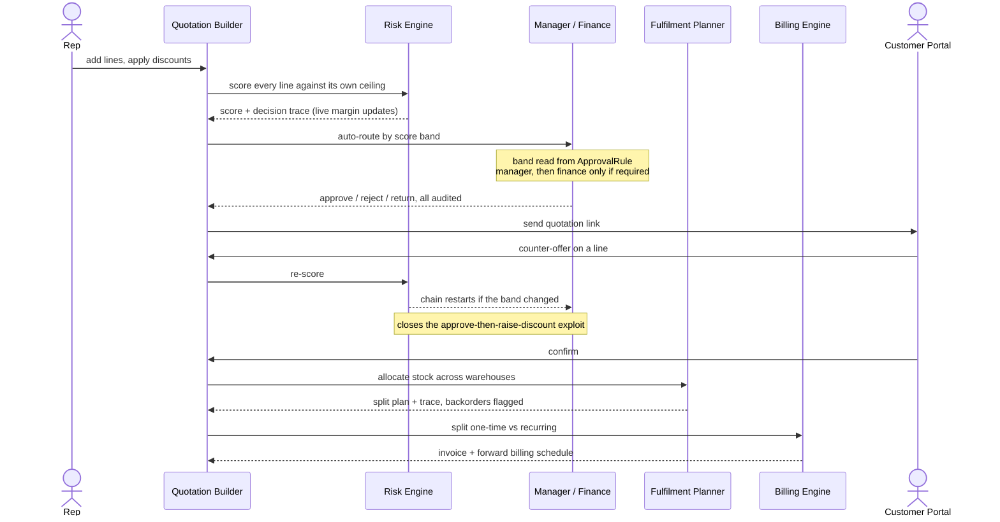

# Architecture

DealFlow360 is a single Next.js application with a strictly layered interior. The layering
is the point of the design: the business rules that this problem is actually about live in
a layer that cannot import a database, a framework, or a clock.

---

## 1. Layers

**The one rule:** dependencies point inwards only. `src/domain` imports nothing from
`next`, `@prisma/client`, or `react` — and nothing from `src/application` or
`src/infrastructure` either. That constraint is what makes the 94 domain tests possible:
no database to spin up, no fixtures to mock, no clock to freeze. It is also the honest
answer to "did you actually implement the rules, or fake them for the demo?" — the rules
are isolated enough to be tested in 1.2 seconds, and they are.

| Layer | Owns | Must not |
|---|---|---|
| `domain` | Business rules, scoring, planning, money arithmetic | Import anything. Read the clock. Touch I/O. |
| `application` | Transactions, orchestration, audit writes | Contain rule logic — it calls the domain for that |
| `infrastructure` | Prisma, sessions, password hashing | Contain business decisions |
| `interface` | Rendering, request parsing, auth guards | Contain rule logic or raw SQL |

---

## 2. Data model

### Modelling decisions worth defending

**Money is `DECIMAL(14,2)`, never `FLOAT`.** In the domain layer it becomes an integer
count of paise. `0.1 + 0.2 !== 0.3` in IEEE-754 floating point, and this system computes
invoices — rounding drift is not acceptable.

**Governance lives in tables, not constants.** `RiskConfig`, `ApprovalRule`,
`TierDiscountCeiling` and `ProductCategory.maxDiscountPct` are all data. A sales director
retunes escalation from the admin screen and the next quotation routes differently, with
no redeploy. It also means a reviewer can change a rule live and watch the behaviour
change, which is the fastest way to prove nothing is hardcoded.

**`QuotationLine` snapshots `unitPrice` and `unitCost`.** They are copied from the price
list at the moment the line is added rather than joined at read time, so a later price
change cannot silently rewrite the numbers on a quotation a customer has already seen.

**`ApprovalStep.triggeredByScore` is stored.** The quotation's live score changes as it is
edited. Keeping the score that actually triggered each step means the approval history
stays truthful instead of being retroactively rewritten.

**`AuditEvent` is append-only.** Nothing in the application updates or deletes a row.
Every approval, rejection, discount change and negotiation leaves a permanent record of
who, what, when and why.

**`User.customerId` is the tenancy boundary.** A portal user is bound to exactly one
customer, and every portal query is scoped through it. The portal is a separate route
group with its own data access path — not an internal screen with a different label.

---

## 3. The end-to-end flow

---

## 4. Where the difficulty actually is

Five decisions carry most of the engineering weight. Each is a pure function with tests.

| Problem | Approach | Why not the obvious thing |
|---|---|---|
| Discount governance | Two independent signals — worst single line, and value-weighted spread — combined as `max(severity, aggregate x amplifier)` | A single order-level limit hides a bad line inside a big order's average, and treats many small breaches as harmless |
| Approval routing | Score bands in the database, resolved to an ordered chain; **fails closed** on a config gap | Hardcoded `if` thresholds cannot be retuned, and silently auto-approve anything they do not cover |
| Warehouse splitting | Single-warehouse fast path, then greedy set cover weighted by order **value** | Minimising shipments is NP-hard; brute force works at demo scale and collapses at 30 depots |
| Hybrid billing | One order, two billing shapes; day-based proration with the clock passed in as an argument | Reading `new Date()` inside the calculation makes proration untestable and un-auditable |
| Discount anomalies | Z-score against **the rep's own** rolling history, suppressed below a minimum sample size | A company-wide threshold cannot tell a habitual 12% seller from someone who never exceeds 3% |

---

## 5. Technology choices

| Choice | Reason | Rejected alternative |
|---|---|---|
| Next.js 16 App Router | UI and API in one process — no CORS, no second service, one `npm run dev` | Separate React SPA + Django/FastAPI: two deploys, two runtimes, more moving parts for a solo build |
| PostgreSQL | Deeply relational data; approval state and stock allocation need real transactions | MongoDB: this domain is joins and invariants, not documents |
| Prisma 7 + `pg` driver adapter | `schema.prisma` doubles as a readable one-file data model; migrations are version-controlled | Raw SQL: faster to start, far slower to evolve safely under time pressure |
| Hand-built auth (`jose` + `bcryptjs`) | RBAC and portal tenancy are graded parts of this problem | Clerk/Auth0: outsources exactly the thing being assessed |
| Vitest on the domain only | The domain is pure, so tests are milliseconds and assert business rules directly | End-to-end tests: slower to write, slower to run, and they prove the UI rather than the rules |
| **No Docker** | One `npm install && npm run dev`. Nothing to build, nothing to trust | Docker: an extra layer with no benefit for a single Node process and a hosted database |
